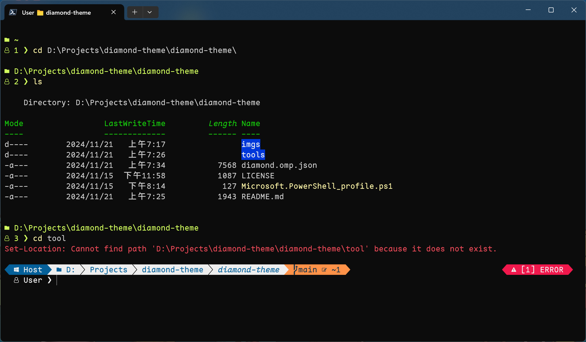

# Diamond Theme

This is an Oh My Posh theme.


## Features




## Usage

Follow the official instruction [here](https://ohmyposh.dev/docs/installation/windows) and don't use `Install-Module oh-my-posh` since that is deprecated. Instead, install Oh My Posh by

```ps
winget install oh-my-posh
```

After installation, copy [`diamond.omp.json`](diamond.omp.json) to Oh My Posh themes directory, which locates at `$env:POSH_THEMES_PATH`. Be aware that theme files **MUST** be in that location to be correctly loaded by Oh My Posh.

While the theme file is in `$env:POSH_THEMES_PATH`, edit `$PROFILE`, which locates at somewhere like `C:\Users\${user}\Documents\PowerShell\Microsoft.PowerShell_profile.ps1`, and append this line of code:

```ps
oh-my-posh init pwsh --config "$env:POSH_THEMES_PATH\${theme}" | Invoke-Expression
```

where `${theme}` is the name of the theme file, in this case, `diamond.omp.json`.

## License

[MIT](http://opensource.org/licenses/MIT)

Copyright © ROC 111 (2022), veringsek