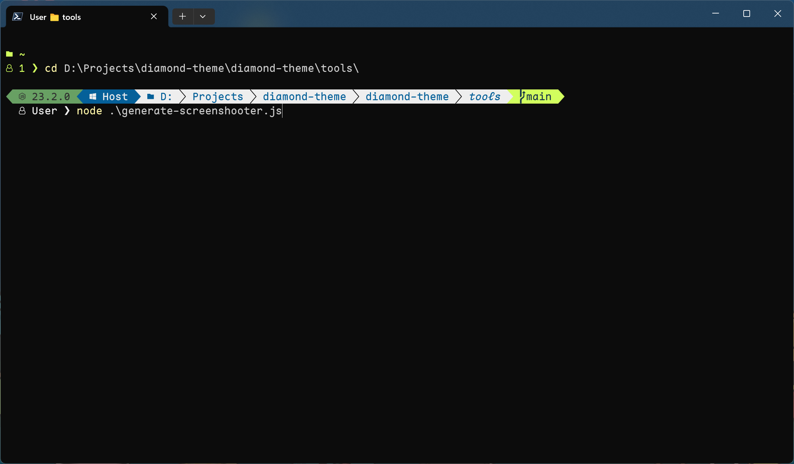

# Diamond Theme

This is an Oh My Posh theme.


## Features

Diamond shows most information on the 1st layer, leaving it clean on the 2nd layer for more space to input command. Executed command lines are simplified and numbered for easier locating.

Other than the basic information such as error and Git, Diamond also supports Node.js and Python Venv to be shown if activated.





Diamond supports system accent color. Keep the system accent color solid and dark for readibility.


## Requirement

Diamond is by design a dark theme, so keep the system accent color solid and dark, and the terminal background color should be black, or at least, near-black.

The support of Python Venv also needs a helper line to hide the default Venv indicator, check [the PowerShell profile](./Microsoft.PowerShell_profile.ps1).

## Usage

Follow the official instruction [here](https://ohmyposh.dev/docs/installation/windows) and don't use `Install-Module oh-my-posh` since that is deprecated. Instead, install Oh My Posh by

```ps
winget install oh-my-posh
```

After installation, copy [`diamond.omp.json`](diamond.omp.json) to Oh My Posh themes directory, which locates at `$env:POSH_THEMES_PATH`. Be aware that theme files **MUST** be in that location to be correctly loaded by Oh My Posh.

While the theme file is in `$env:POSH_THEMES_PATH`, edit `$PROFILE`, which locates at somewhere like `C:\Users\${user}\Documents\PowerShell\Microsoft.PowerShell_profile.ps1`, and append this line of code:

```ps
oh-my-posh init pwsh --config "$env:POSH_THEMES_PATH\${theme}" | Invoke-Expression
```

where `${theme}` is the name of the theme file, in this case, `diamond.omp.json`.

## License

[MIT](http://opensource.org/licenses/MIT)

Copyright © ROC 111 (2022), veringsek